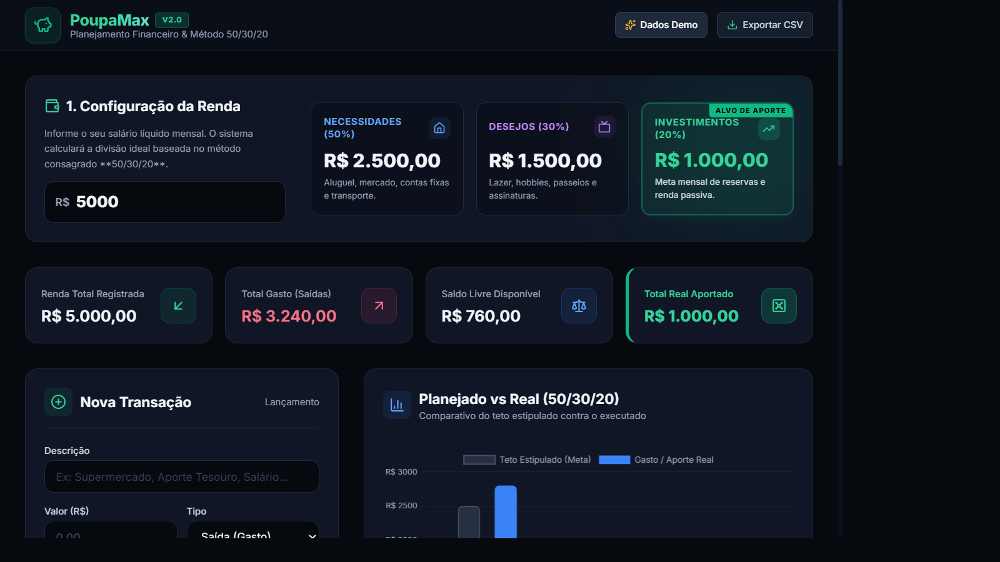
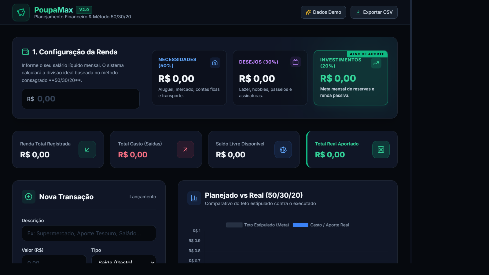
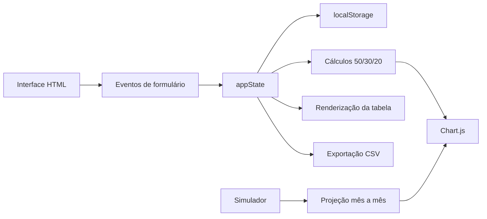

# PoupaMax Finanças

<p align="center">
  <strong>Gestão financeira pessoal com método 50/30/20</strong><br>
  Registre transações, acompanhe seus limites e projete o crescimento dos seus investimentos.
</p>

<p align="center">
  <a href="#funcionalidades">Funcionalidades</a> &middot;
  <a href="#arquitetura">Arquitetura</a> &middot;
  <a href="#acessibilidade-e-performance">Acessibilidade</a> &middot;
  <a href="#execução-local">Execução local</a>
</p>

## Visão geral

O PoupaMax é uma aplicação financeira client-side, responsiva e sem backend. Todos os dados ficam no `localStorage` do navegador, permitindo testar o fluxo completo sem cadastro ou envio de informações pessoais para um servidor.

A interface combina um painel de acompanhamento, um histórico de transações, gráficos interativos e um simulador de juros compostos. O projeto foi pensado como uma aplicação de portfólio simples de executar e fácil de publicar com GitHub Pages.

## Capturas de tela

### Painel com dados demonstrativos



### Estado inicial



## Funcionalidades

- Distribuição da renda pelo método 50/30/20.
- Cadastro de entradas, gastos e aportes.
- Classificação por categoria e pilar financeiro.
- Resumo de renda, saídas, saldo e total aportado.
- Gráfico de planejado versus realizado.
- Simulador de juros compostos com capital inicial, aporte mensal, taxa e período.
- Projeção anual detalhada do patrimônio.
- Filtro de transações por descrição ou categoria.
- Exclusão de lançamentos com confirmação acessível.
- Exportação do histórico em CSV.
- Dados de demonstração para apresentação do produto.
- Persistência local no navegador.

## Arquitetura

O projeto usa uma arquitetura client-side de arquivo único:

```text
poupamax-financas/
├── index.html                  # Estrutura, estilos, UI e lógica da aplicação
├── README.md                   # Documentação e guia do projeto
└── screenshots/
    ├── dashboard-demo.png      # Captura com dados de demonstração
    └── dashboard-vazio.png     # Captura do estado inicial
```

### Fluxo da aplicação



### Tecnologias

- HTML5 sem framework.
- Tailwind CSS via CDN para layout e utilitários.
- JavaScript Vanilla para estado, eventos e cálculos.
- Chart.js para gráficos.
- Lucide para iconografia.
- `localStorage` para persistência local.

## Acessibilidade e performance

- Documento identificado com `lang="pt-BR"`.
- Controles com nomes acessíveis e tipos explícitos.
- Modal de confirmação com `role="dialog"`, `aria-modal`, título e descrição associados.
- Toasts anunciados com `role="status"` e `aria-live="polite"`.
- Gráficos com nomes acessíveis via `role="img"` e `aria-label`.
- Campos numéricos complementados com descrições e rótulos claros.
- Tabelas com `caption` acessível para tecnologias assistivas.
- Chart.js e Lucide carregados com `defer`, evitando bloquear a construção inicial da página.
- Persistência local, sem chamadas de API ou processamento em servidor.
- Texto do usuário escapado antes de ser inserido na tabela, reduzindo risco de XSS.

## Execução local

Como o projeto é estático, basta abrir o arquivo no navegador:

```text
index.html
```

Também é possível usar um servidor estático local, por exemplo:

```bash
npx serve .
```

Depois, abra o endereço exibido pelo comando.

## Publicação no GitHub Pages

1. Crie um repositório chamado `poupamax-financas`.
2. Envie `index.html`, `README.md` e a pasta `screenshots/` para a branch `main`.
3. Em **Settings > Pages**, selecione **Deploy from a branch**.
4. Escolha a branch `main` e a pasta `/ (root)`.
5. Salve e aguarde a publicação.

A URL esperada será:

```text
https://SEU_USUARIO.github.io/poupamax-financas/
```

## Licença

Este projeto é um exemplo de portfólio. Adicione a licença que preferir antes de distribuí-lo publicamente.
